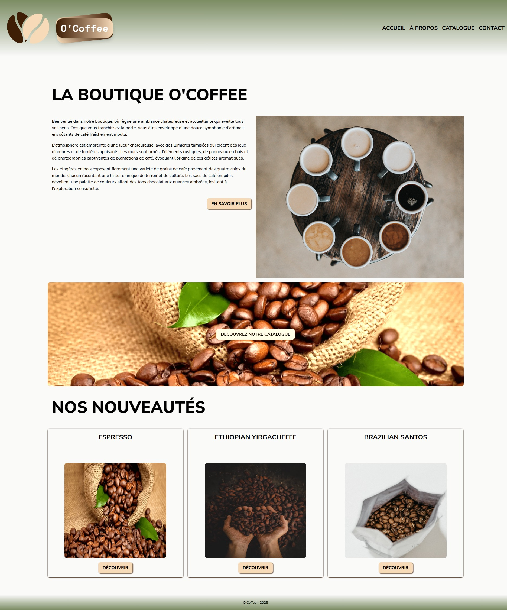
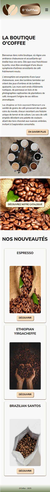

# O'Coffee

---

O'Coffee est un site e-commerce fictif développer lors de ma formation chez O'clock. J'utilise Express et EJS pour créer un site en Server-Side Rendering (SSR)

C'est un MVC utilisant:

- un dataMapper pour gérer l'accès aux données,  
- des views gérées avec EJS,
- et des controllers qui font le lien entre modèles et vues.
  
---

